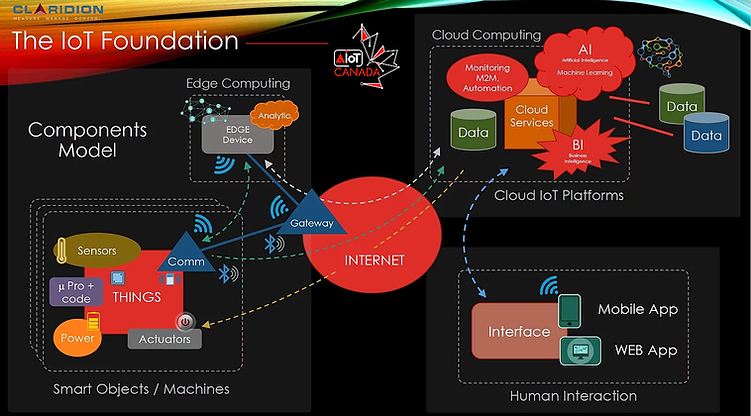
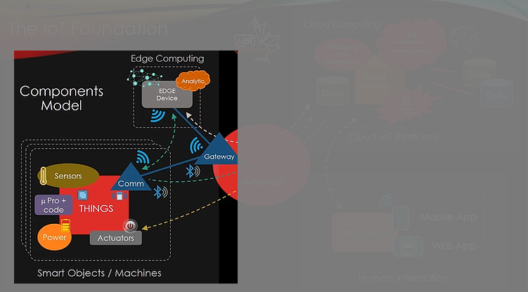
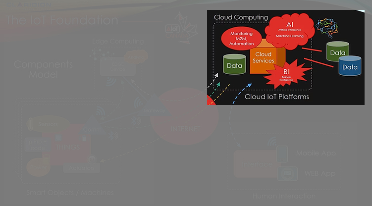
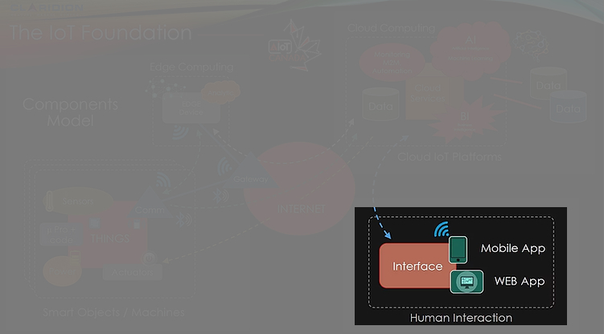

# Porfolio

Selected projects modeled on the  AIoTCanada Business Model:

## Smart Objects and Edge Computing

|  |     |
|:-----|:-----|
| Electronics, sensors, and actuators with C on Arduino | Link  |
| Raspberry Pi alarm system with buttons; with Tkinter | Link  |
| Raspberry Pi alarm system with a screen keypad; with Pygame | Link  |
| RPi Voice-commanded Domotic System; with Tkinter | Link  |
| **Comprehensive Project:** |       |
| Raspberry Pi Pico node (microcontroller and sensor) to a Streamlit dashboard via MQTT and MongoDB | Link  |

## Cloud Computing and Platforms, Databases, Computing, ML, and AI

|  |     |
|:-----|:-----|
| Databases: MariaDB for SQL, MongoDB for NoSQL; and Big Data | Link  |
| Operational research, linear programming, and algorithmics | Link  |
| Unit testing with pytest, doctest, and code typing with mypy | Link  |
| Machine Learning with a Random Forests model; predicting obesity | Link  |
| **Comprehensive Project:** |       |
| Raspberry Pi Pico node (microcontroller and sensor) to a Streamlit dashboard via MQTT and MongoDB | Link  |

## Interaction
 
|  |     |
|:-----|:-----|
| Interactive web page; a coloring grid | Link  |
| Search box that pulls either GIF or stickers from GIPHY | Link  |
| Backend server with MongoDB and frontend web site | ?  |
| React-Native weather app; with Expo | ?  |
| React-Native IoT app to command a connected object; though a MQTT server | ?  |
| **Comprehensive Project:** |       |
| Raspberry Pi Pico node (microcontroller and sensor) to a Streamlit dashboard via MQTT and MongoDB | Link  |
