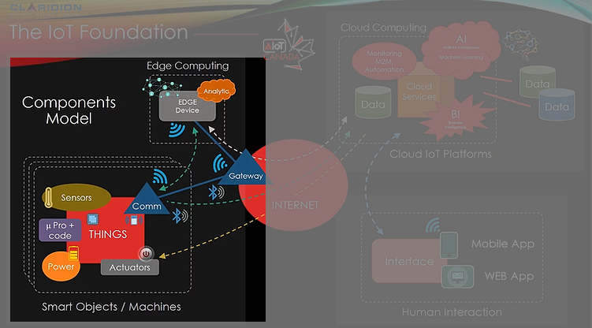

# Porfolio

Selected projects modeled on the  AIoTCanada Business Model:

## Smart Objects and Edge Computing

    

        
    

    

        TABLEAU A
        TABLEAU A
    

    

## Cloud Computing, Databases, and Platforms

TABLEAU B

## Interaction
 

TABLEAU C
